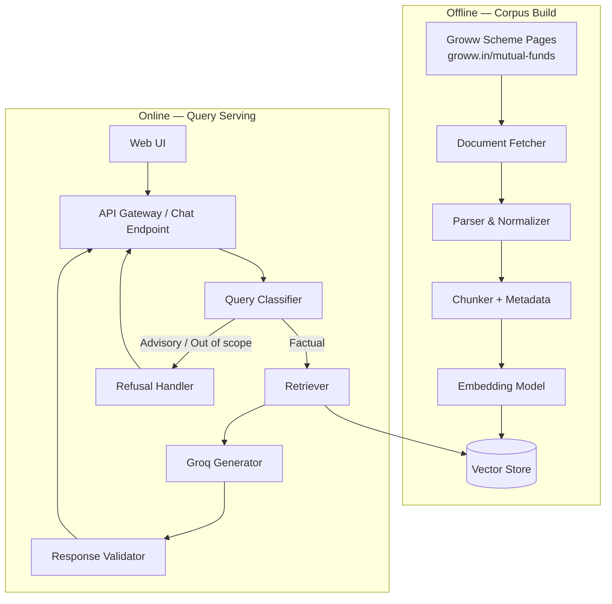
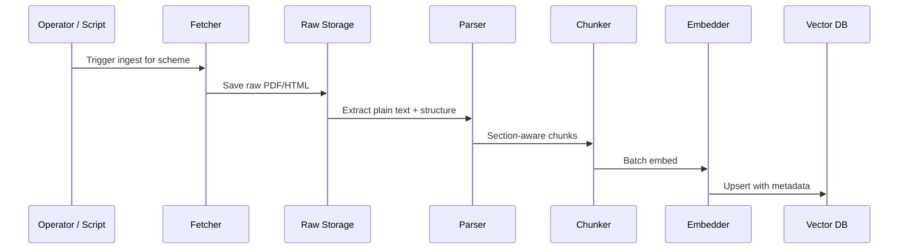
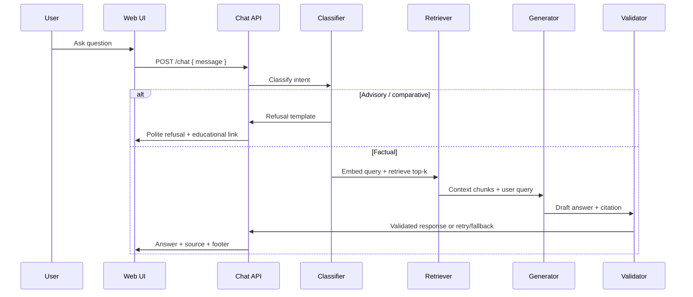
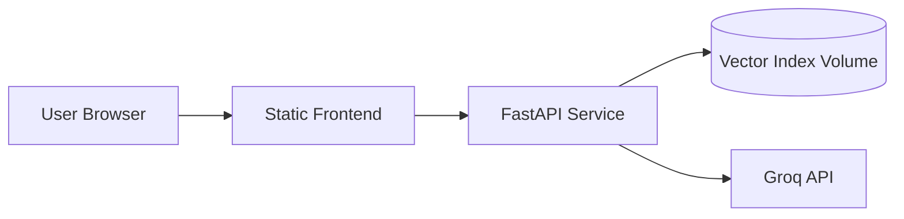
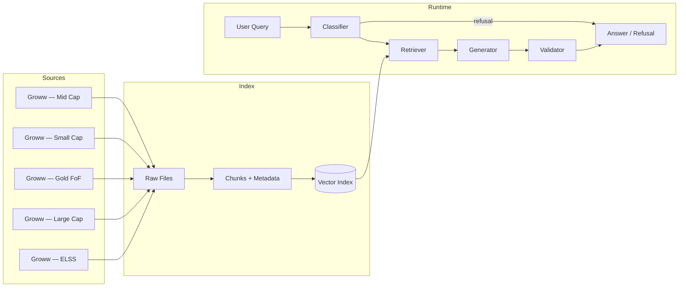

# Architecture: Mutual Fund FAQ Assistant

> **Facts-only. No investment advice.**

This document describes the system architecture for a lightweight, compliance-first Retrieval-Augmented Generation (RAG) assistant that answers factual mutual fund queries by retrieving information from **Groww scheme pages** — the reference product context defined in the [Problem Statement](./problemStatement.md).

**Related documents:** [Problem Statement](./problemStatement.md)

---

## Table of Contents

1. [Design Principles](#1-design-principles)
2. [High-Level Architecture](#2-high-level-architecture)
3. [Component Overview](#3-component-overview)
4. [Data Pipeline (Offline)](#4-data-pipeline-offline)
5. [Query Pipeline (Online)](#5-query-pipeline-online)
6. [RAG Design](#6-rag-design)
7. [Query Classification & Refusal Handling](#7-query-classification--refusal-handling)
8. [Response Contract](#8-response-contract)
9. [Corpus & Source Model](#9-corpus--source-model)
10. [User Interface](#10-user-interface)
11. [Technology Stack](#11-technology-stack)
12. [Project Structure](#12-project-structure)
13. [Security, Privacy & Compliance](#13-security-privacy--compliance)
14. [Deployment Model](#14-deployment-model)
15. [Observability & Quality](#15-observability--quality)
16. [Known Limitations](#16-known-limitations)
17. [Future Extensions (Out of Scope)](#17-future-extensions-out-of-scope)

---

## 1. Design Principles

| Principle | Implication |
|-----------|-------------|
| **Accuracy over intelligence** | Prefer retrieved facts and templated responses over open-ended LLM reasoning |
| **Source-backed only** | Every factual answer cites exactly one Groww scheme URL; no unsourced claims |
| **Facts-only boundary** | Classify and refuse advisory, comparative, or speculative queries before retrieval |
| **Minimal surface area** | No user accounts, no PII collection, no session persistence of sensitive data |
| **Groww corpus only** | Corpus built exclusively from the 5 Groww mutual fund scheme pages listed in the problem statement |
| **Deterministic guardrails** | Post-generation validation enforces sentence count, citation presence, and disclaimer footer |

---

## 2. High-Level Architecture

The system splits into an **offline ingestion path** (corpus build) and an **online query path** (user Q&A). A thin web UI talks to a single backend API that orchestrates classification, retrieval, generation, and validation.



### Request lifecycle (summary)

1. User submits a question via the UI.
2. Backend classifies intent (factual vs advisory vs out-of-scope).
3. For factual queries: retrieve top-k relevant chunks, generate a constrained answer, validate format.
4. For advisory queries: return a polite refusal with an educational link.
5. UI renders the response with citation and footer.

---

## 3. Component Overview

| Component | Responsibility | Runs |
|-----------|----------------|------|
| **Document Fetcher** | Download Groww scheme pages (HTML) for each of the 5 HDFC funds | Offline |
| **Parser** | Extract text from Groww HTML; preserve key fund attributes (tables, labels) | Offline |
| **Chunker** | Split documents into retrieval units with rich metadata | Offline |
| **Embedding Service** | Convert chunks to vectors | Offline (+ query time) |
| **Vector Store** | Persist embeddings and metadata for similarity search | Both |
| **Query Classifier** | Detect advisory/comparative/performance-calculation intent | Online |
| **Retriever** | Hybrid or dense retrieval scoped by scheme/category | Online |
| **Generator** | Call Groq to produce ≤3-sentence answer grounded in retrieved context | Online |
| **Response Validator** | Enforce citation, sentence limit, footer, no advice language | Online |
| **Refusal Handler** | Return compliant refusal + Groww educational link | Online |
| **Web UI** | Chat input, example prompts, disclaimer, citation display | Online |

---

## 4. Data Pipeline (Offline)

### 4.1 Source acquisition

The corpus is built from **one Groww scheme page per fund** — the same URLs listed in [Problem Statement §1](./problemStatement.md#1-corpus-definition). No AMC, AMFI, or SEBI sites are ingested separately.

| Scheme | Category | Corpus URL (Groww) |
|--------|----------|-------------------|
| HDFC Mid Cap Fund Direct Growth | Mid-cap | https://groww.in/mutual-funds/hdfc-mid-cap-fund-direct-growth |
| HDFC Small Cap Fund Direct Growth | Small-cap | https://groww.in/mutual-funds/hdfc-small-cap-fund-direct-growth |
| HDFC Gold ETF Fund of Fund Direct Plan Growth | Gold / FoF | https://groww.in/mutual-funds/hdfc-gold-etf-fund-of-fund-direct-plan-growth |
| HDFC Large Cap Fund Direct Growth | Large-cap | https://groww.in/mutual-funds/hdfc-large-cap-fund-direct-growth |
| HDFC ELSS Tax Saver Fund Direct Plan Growth | ELSS | https://groww.in/mutual-funds/hdfc-elss-tax-saver-fund-direct-plan-growth |

Each page is the **single source of truth** for that scheme. Facts such as expense ratio, exit load, minimum SIP, riskometer, benchmark, and lock-in (where shown) are extracted from the page content at ingest time.

**Refusal citations (not ingested):** Advisory refusals link to the Groww mutual funds overview — https://groww.in/p/mutual-funds — rather than a separate regulatory site.

### 4.2 Ingestion flow



### 4.3 Parsing strategy

- **Groww scheme pages (HTML):** Fetch each scheme URL; extract main fund details (expense ratio, exit load, min SIP, riskometer, benchmark, lock-in, etc.). Use BeautifulSoup / trafilatura; if content is JS-rendered, use Playwright or similar for a one-time ingest snapshot.
- **Normalization:** Unicode cleanup, whitespace collapse, strip navigation chrome; retain labeled attribute blocks.
- **Date extraction:** Use page `Last updated` text if present; otherwise fall back to `ingested_at`.

### 4.4 Chunking strategy

| Parameter | Recommended value | Rationale |
|-----------|-------------------|-----------|
| Chunk size | 400–800 tokens | Fits single facts (expense ratio, lock-in) without noise |
| Overlap | 50–100 tokens | Preserves context across section boundaries |
| Split boundary | Headings, tables, paragraphs | Keeats semantic units intact |

**Required chunk metadata:**

```json
{
  "scheme_id": "hdfc-elss-tax-saver-direct-growth",
  "scheme_name": "HDFC ELSS Tax Saver Fund Direct Plan Growth",
  "category": "ELSS",
  "amc": "HDFC Mutual Fund",
  "document_type": "groww_scheme_page",
  "source_url": "https://groww.in/mutual-funds/hdfc-elss-tax-saver-fund-direct-plan-growth",
  "source_domain": "groww.in",
  "page_or_section": "Scheme Information",
  "content_hash": "sha256:...",
  "document_date": "2025-07-31",
  "ingested_at": "2026-08-23T00:00:00Z"
}
```

### 4.5 Re-indexing policy

- Re-run ingestion when Groww scheme page content changes (spot-check monthly or on demand).
- Store `document_date` and surface the latest date in the response footer.
- Version chunks by `content_hash`; deduplicate on re-ingest.

---

## 5. Query Pipeline (Online)



### 5.1 API surface (minimal)

| Endpoint | Method | Purpose |
|----------|--------|---------|
| `/health` | GET | Liveness check |
| `/chat` | POST | Accept user message; return assistant response |
| `/schemes` | GET | List indexed schemes (optional, for UI hints) |

**Example request:**

```json
{
  "message": "What is the expense ratio of HDFC Large Cap Fund Direct Growth?"
}
```

**Example factual response:**

```json
{
  "type": "answer",
  "text": "The direct plan growth option of HDFC Large Cap Fund carries an expense ratio of 0.96% as per the Groww scheme page. This ratio represents the annual fee charged by the fund house for managing the scheme.",
  "citation": {
    "url": "https://groww.in/mutual-funds/hdfc-large-cap-fund-direct-growth",
    "title": "HDFC Large Cap Fund Direct Growth — Groww"
  },
  "footer": "Last updated from sources: 2025-07-31",
  "disclaimer": "Facts-only. No investment advice."
}
```

**Example refusal response:**

```json
{
  "type": "refusal",
  "text": "I can only answer factual questions about mutual fund schemes and cannot provide investment advice or recommendations. For general guidance on mutual funds, please refer to Groww's investor resources.",
  "citation": {
    "url": "https://groww.in/p/mutual-funds",
    "title": "Mutual Funds on Groww"
  },
  "footer": "Last updated from sources: 2026-08-23",
  "disclaimer": "Facts-only. No investment advice."
}
```

---

## 6. RAG Design

### 6.1 Retrieval

**Approach:** Dense vector retrieval with optional metadata filtering.

1. Embed the user query with the same model used at ingest time.
2. Filter by `scheme_name` or `category` if detected in the query (entity extraction or keyword match).
3. Retrieve top **k = 5** chunks; rerank to **top 3** if a cross-encoder reranker is available (optional for v1).
4. Pass retrieved chunks + metadata (especially `source_url`, `document_date`) to the generator.

**Fallback when retrieval confidence is low:**

- If max similarity score < threshold, respond: *"I couldn't find verified information for that query in our sources"* and link to the relevant **Groww scheme page** if the scheme is identified.

### 6.2 Generation

The generator calls **Groq** (`llama-3.3-70b-versatile` by default) under a **strict system prompt** that:

- Restricts answers to provided context only (no parametric knowledge).
- Limits output to **3 sentences maximum**.
- Requires citing the **single** `source_url` from the highest-confidence retrieved chunk.
- Prohibits advice, comparisons, return calculations, and speculative language.

**Prompt structure (conceptual):**

```
System: You are a facts-only mutual fund FAQ assistant. Answer ONLY using
        the provided context. Max 3 sentences. No advice. No comparisons.

Context:
  [Chunk 1 — metadata + text]
  [Chunk 2 — metadata + text]

User: {question}

Assistant:
```

### 6.3 Grounding & hallucination control

| Control | Mechanism |
|---------|-----------|
| Context-only answers | System prompt + low temperature (0–0.2) |
| Citation binding | Validator checks URL ∈ retrieved chunk metadata |
| Numeric facts | Prefer chunks containing numbers matching query type (regex/heuristics) |
| Performance queries | Bypass generation; return Groww scheme page link only |

---

## 7. Query Classification & Refusal Handling

Classification runs **before** retrieval to avoid retrieving context that might tempt the model to compare or recommend.

### 7.1 Intent categories

| Category | Examples | Action |
|----------|----------|--------|
| **Factual** | "What is the exit load?", "ELSS lock-in period?" | RAG pipeline |
| **Advisory** | "Should I invest?", "Is this fund good?" | Refusal |
| **Comparative** | "Which fund is better?", "HDFC vs ICICI" | Refusal |
| **Performance calc** | "What returns will I get?", "CAGR if I invest 10k" | Refusal or Groww scheme page link only |
| **PII / account** | "My PAN is...", "Check my balance" | Refusal + no storage |
| **Out of scope** | Unrelated topics | Polite boundary message |

### 7.2 Classifier implementation options

| Option | Pros | Cons |
|--------|------|------|
| **Rule-based + keywords** | Fast, deterministic, no extra model | May miss paraphrases |
| **Small LLM classifier** | Better paraphrase handling via Groq | Adds latency; use only for ambiguous cases |
| **Hybrid (recommended)** | Rules for high-confidence advisory patterns; Groq (`llama-3.1-8b-instant`) for ambiguous cases | Slightly more complex |

**High-confidence refusal patterns (rule-based):**

- *should I*, *recommend*, *better fund*, *best fund*, *worth investing*, *buy or sell*, *predict*, *returns if I*, *compare*

### 7.3 Refusal response template

- Acknowledge the question politely.
- State the facts-only limitation explicitly.
- Provide one educational link (Groww mutual funds overview: https://groww.in/p/mutual-funds).
- Include standard disclaimer footer.

---

## 8. Response Contract

Every assistant message—factual or refusal—must satisfy:

| Rule | Enforcement |
|------|-------------|
| ≤ 3 sentences | Sentence tokenizer + count in validator |
| Exactly 1 citation URL | Regex URL check; must match allowed domains |
| Footer with date | `Last updated from sources: <document_date or ingest date>` |
| Disclaimer present | Static string in UI and/or API payload |
| No advice language | Blocklist: *recommend, should invest, better, guaranteed, predict* |

**Performance-related queries:** Do not compute or state returns. Response = one sentence + Groww scheme page link.

---

## 9. Corpus & Source Model

### 9.1 Selected AMC and schemes

**AMC:** HDFC Mutual Fund  
**Corpus provider:** Groww (`groww.in`)

| Scheme | Category | Groww URL (corpus + citation) |
|--------|----------|-------------------------------|
| HDFC Mid Cap Fund Direct Growth | Mid-cap | https://groww.in/mutual-funds/hdfc-mid-cap-fund-direct-growth |
| HDFC Small Cap Fund Direct Growth | Small-cap | https://groww.in/mutual-funds/hdfc-small-cap-fund-direct-growth |
| HDFC Gold ETF Fund of Fund Direct Plan Growth | Gold / FoF | https://groww.in/mutual-funds/hdfc-gold-etf-fund-of-fund-direct-plan-growth |
| HDFC Large Cap Fund Direct Growth | Large-cap | https://groww.in/mutual-funds/hdfc-large-cap-fund-direct-growth |
| HDFC ELSS Tax Saver Fund Direct Plan Growth | ELSS | https://groww.in/mutual-funds/hdfc-elss-tax-saver-fund-direct-plan-growth |

Each scheme maps to **exactly one ingested URL**. The `source_url` on every chunk and every factual citation must be that scheme's Groww page.

### 9.2 Allowed source domains (allowlist)

```
groww.in
*.groww.in
```

The validator rejects citations outside this allowlist. Factual answers cite the relevant scheme page; refusals cite https://groww.in/p/mutual-funds.

### 9.3 Fact type → source mapping

All fact types resolve to the **same Groww scheme page** for the fund in question:

| Query type | Source |
|------------|--------|
| Expense ratio, exit load, min SIP | Groww scheme page — fund details section |
| Riskometer, benchmark | Groww scheme page — fund overview |
| ELSS lock-in | Groww scheme page — fund details / tax section |
| Performance / returns | Groww scheme page link only (no computed values) |
| Statement download process | Groww scheme page or help content (if present on page) |

---

## 10. User Interface

Minimal single-page chat interface.

### 10.1 Layout

```
┌─────────────────────────────────────────────────────┐
│  Mutual Fund FAQ Assistant                          │
│  Facts-only. No investment advice.                  │
├─────────────────────────────────────────────────────┤
│  Welcome message explaining scope and limitations   │
│                                                     │
│  Example questions (clickable):                     │
│   • What is the expense ratio of HDFC Large Cap?    │
│   • What is the ELSS lock-in period?                │
│   • What is the exit load on HDFC Mid Cap Fund?     │
├─────────────────────────────────────────────────────┤
│  [ Chat message history ]                           │
│                                                     │
│  Assistant: ...                                     │
│  Source: https://groww.in/mutual-funds/hdfc-large-cap-fund-direct-growth │
│  Last updated from sources: 2025-07-31              │
├─────────────────────────────────────────────────────┤
│  [ Ask a factual question...              ] [Send]  │
└─────────────────────────────────────────────────────┘
```

### 10.2 UI requirements

- Persistent disclaimer banner: **"Facts-only. No investment advice."**
- Three pre-filled example questions (as specified in problem statement).
- Citation rendered as a clickable link opening in a new tab.
- No login, no cookies for PII, no chat export containing user identifiers.
- Mobile-friendly responsive layout.

---

## 11. Technology Stack

Recommended lightweight stack for a learning/portfolio implementation:

| Layer | Technology | Notes |
|-------|------------|-------|
| **Backend** | Python 3.11+ / FastAPI | Async API, easy ML ecosystem |
| **RAG orchestration** | LangChain or LlamaIndex | Chunking, retrieval chains |
| **Embeddings** | Local open-source (`bge-small-en` via `sentence-transformers`) | Groq does not provide embeddings; run locally at ingest + query time |
| **Vector store** | Chroma (local) or FAISS | Zero-ops for dev; persistent index |
| **LLM** | **Groq API** (`groq` Python SDK) | Fast inference; OpenAI-compatible chat completions |
| **HTML parsing** | BeautifulSoup / trafilatura; Playwright if JS-rendered | Groww scheme page extraction |
| **Frontend** | React + Vite or plain HTML/JS | Minimal chat UI |
| **Config** | `.env` for API keys | Never commit secrets |

### 11.1 Why this stack

- **Python + FastAPI:** Standard for RAG prototypes; rich document tooling.
- **Local vector store:** No external DB required for v1; aligns with "lightweight" goal.
- **Groq for generation:** Low-latency inference on open models (Llama, Mixtral); well-suited to narrow summarization tasks with strict prompting.
- **Local embeddings:** Keeps retrieval offline and avoids a second paid API; Groq is used only for text generation (and optional classification).

### 11.2 Groq LLM integration

Groq is the **sole LLM provider** for this project. It powers answer generation and, optionally, ambiguous query classification.

| Use case | Recommended Groq model | Notes |
|----------|------------------------|-------|
| **Answer generation** | `llama-3.3-70b-versatile` | Primary model; grounded factual summarization |
| **Fast fallback / retry** | `llama-3.1-8b-instant` | Lower latency on validator retry or simple queries |
| **Ambiguous classification** (optional) | `llama-3.1-8b-instant` | Hybrid classifier only; rule-based layer runs first |

**Client:** Official [`groq`](https://github.com/groq/groq-python) Python SDK.

**Configuration (`.env`):**

```bash
GROQ_API_KEY=gsk_...
GROQ_MODEL=llama-3.3-70b-versatile
GROQ_MODEL_FAST=llama-3.1-8b-instant   # optional fallback / classifier
GROQ_MAX_TOKENS=256
GROQ_TEMPERATURE=0.1
```

**Integration pattern:**

```python
from groq import Groq

client = Groq(api_key=settings.groq_api_key)
response = client.chat.completions.create(
    model=settings.groq_model,
    messages=[
        {"role": "system", "content": system_prompt},
        {"role": "user", "content": user_prompt},
    ],
    temperature=settings.groq_temperature,
    max_tokens=settings.groq_max_tokens,
)
```

**Design constraints with Groq:**

- Keep `max_tokens` low (≤ 256) — answers are capped at 3 sentences.
- Use temperature **0–0.2** to reduce hallucination.
- Pass retrieved context in the user message; system prompt enforces context-only answers.
- Handle Groq rate limits (429) with a single exponential backoff retry, then return a Groww scheme-page fallback.
- Do **not** send PII to Groq — classifier blocks PII before any LLM call.

**Suggested module:** `src/generation/groq_client.py` — thin wrapper around the SDK shared by `generator.py` and optional classifier.

---

## 12. Project Structure

```
rag-chatbot/
├── docs/
│   ├── problemStatement.md
│   └── Architecture.md          # this file
├── data/
│   ├── raw/                     # downloaded PDFs/HTML
│   ├── processed/               # normalized text
│   └── index/                   # vector store persistence
├── src/
│   ├── ingestion/
│   │   ├── fetcher.py
│   │   ├── parser.py
│   │   ├── chunker.py
│   │   └── indexer.py
│   ├── retrieval/
│   │   ├── embedder.py
│   │   └── retriever.py
│   ├── generation/
│   │   ├── groq_client.py       # Groq SDK wrapper
│   │   ├── classifier.py
│   │   ├── generator.py
│   │   ├── validator.py
│   │   └── refusal.py
│   ├── api/
│   │   ├── main.py
│   │   └── routes/chat.py
│   └── config/
│       ├── schemes.yaml         # scheme registry + source URLs
│       └── settings.py
├── frontend/
│   ├── index.html
│   └── app.js
├── scripts/
│   └── ingest.py                # CLI: rebuild corpus index
├── tests/
│   ├── test_classifier.py
│   ├── test_validator.py
│   └── test_retrieval.py
├── .env.example
├── requirements.txt
└── README.md
```

---

## 13. Security, Privacy & Compliance

### 13.1 Data handling

| Data | Policy |
|------|--------|
| User queries | Ephemeral processing; optional anonymized logs without PII |
| PAN, Aadhaar, account numbers, OTP, email, phone | **Never** accepted or stored; classifier blocks and discards |
| API keys | Environment variables only |
| Corpus documents | Public Groww scheme pages; stored locally as parsed snapshots |

### 13.2 Input sanitization

- Reject payloads containing PII patterns (PAN format, Aadhaar, email, phone).
- Truncate excessively long inputs.
- Rate-limit `/chat` to prevent abuse.

### 13.3 Content compliance

- No personalized investment advice.
- No fund rankings or "better/worse" language in outputs.
- Performance questions → Groww scheme page link only.

---

## 14. Deployment Model

### 14.1 Development

```bash
# Terminal 1 — API
uvicorn src.api.main:app --reload --port 8000

# Terminal 2 — Frontend (static)
python -m http.server 5173 -d frontend
```

Frontend calls `http://localhost:8000/chat`.

### 14.2 Production (optional)

| Component | Option |
|-----------|--------|
| API | Docker container on Railway / Render / Fly.io |
| Frontend | Static hosting (Vercel, Netlify, S3) |
| Vector index | Baked into container image or mounted volume |
| Secrets | Platform env vars |



---

## 15. Observability & Quality

### 15.1 Metrics to track

- Retrieval hit rate (similarity above threshold)
- Refusal rate by category
- Validator rejection rate (regeneration needed)
- Response latency (p50, p95)

### 15.2 Evaluation set

Maintain a fixed set of ~20 factual Q&A pairs with expected facts and source URLs:

| Question | Expected fact | Source |
|----------|---------------|--------|
| Expense ratio of HDFC Large Cap Direct Growth | (from Groww page) | groww.in |
| ELSS lock-in period | 3 years | groww.in (ELSS scheme page) |
| Exit load on HDFC Mid Cap | (from Groww page) | groww.in |

Plus ~10 advisory questions that must always trigger refusal.

### 15.3 Manual QA checklist

- [ ] Factual answer ≤ 3 sentences
- [ ] Exactly one citation from allowlisted domain
- [ ] Footer date matches source document date
- [ ] Advisory question returns refusal, not an answer
- [ ] Performance question returns Groww scheme page link only
- [ ] Disclaimer visible in UI

---

## 16. Known Limitations

| Limitation | Mitigation |
|------------|------------|
| Corpus covers only 5 HDFC schemes | Document scope clearly in UI welcome message |
| Groww page content updates; answers may stale | Show `Last updated from sources` date prominently; re-ingest on schedule |
| Groww HTML/JS rendering may block simple fetch | Use Playwright snapshot or manual HTML export for ingest |
| Attribute labels on Groww may change layout | Manual verification during ingest; structured fields for critical facts |
| Classifier may miss subtle advisory phrasing | Expand rule set; add eval cases over time |
| No real-time fetch from Groww at query time | Scheduled re-ingestion; v2 could add live page fetch |
| Statement download flows may not be on scheme page | Link to Groww scheme page or refuse with scope message |

---

## 17. Future Extensions (Out of Scope)

The following are explicitly **not** part of v1 but may be considered later:

- Multi-AMC corpus expansion
- Live Groww page fetch at query time
- Cross-encoder reranking for improved retrieval
- Admin dashboard for ingest status and source freshness
- Multilingual support (Hindi)
- Voice interface

---

## Appendix A: End-to-End Data Flow



---

## Appendix B: Mapping to Success Criteria

| Success criterion (from problem statement) | Architectural mechanism |
|---------------------------------------------|-------------------------|
| Accurate retrieval of factual information | Curated corpus + metadata-filtered retrieval + grounding prompt |
| Strict facts-only responses | Pre-retrieval classifier + post-generation validator |
| Valid source citations | Citation bound to chunk metadata; domain allowlist |
| Proper refusal of advisory queries | Rule/Groq classifier + refusal templates |
| Clean, minimal UI | Single-page chat with disclaimer and example prompts |
