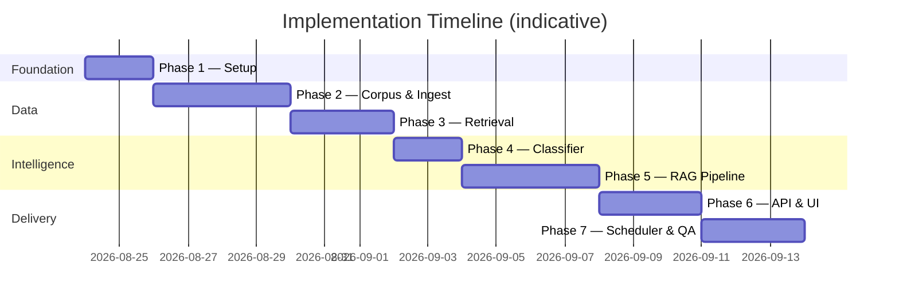
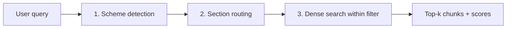
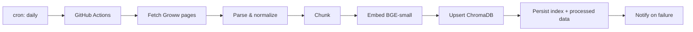
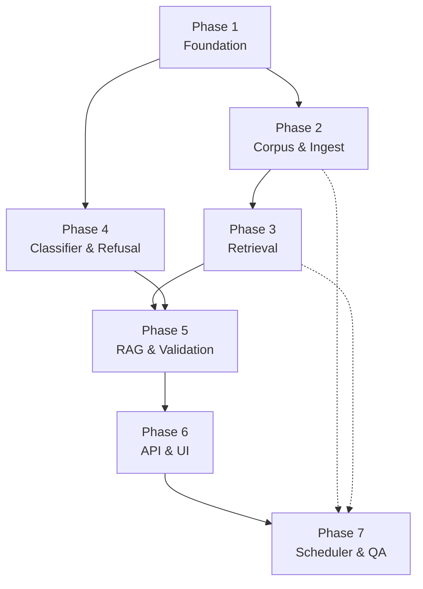

# Implementation Plan: Mutual Fund FAQ Assistant

> **Facts-only. No investment advice.**

Phase-wise plan to build the RAG-based mutual fund FAQ assistant described in [Problem Statement](./problemStatement.md) and [Architecture](./Architecture.md).

---

## Overview

| Item | Detail |
|------|--------|
| **Goal** | Ship a facts-only FAQ assistant for 5 HDFC mutual fund schemes |
| Approach | Offline corpus ingestion + online classify → retrieve → **Groq generate** → validate |
| **Total phases** | 7 |
| **Estimated duration** | 3–4 weeks (solo developer, part-time) |

### Phase summary



| Phase | Name | Primary output | Depends on |
|-------|------|----------------|------------|
| 1 | Project foundation | Repo scaffold, config, dependencies | — |
| 2 | Corpus & ingestion | Indexed documents for 5 schemes | Phase 1 |
| 3 | Retrieval layer | Working vector search | Phase 2 |
| 4 | Query classification & refusal | Advisory blocking before RAG | Phase 1 |
| 5 | RAG generation & validation | End-to-end factual answers | Phases 3, 4 |
| 6 | API & frontend | Usable chat interface | Phase 5 |
| 7 | Scheduler, QA & delivery | Daily GitHub Actions ingest, README, eval pass, demo-ready | Phase 6 |

---

## Phase 1: Project Foundation

**Objective:** Establish repo structure, tooling, and configuration so later phases can plug in cleanly.

**Duration:** 1–2 days

### Tasks

- [ ] Initialize Python project with `requirements.txt` (FastAPI, uvicorn, chromadb/faiss, langchain or llama-index, beautifulsoup4/trafilatura, playwright optional, python-dotenv, pydantic, **groq**, **sentence-transformers**)
- [ ] Create directory layout per [Architecture §12](./Architecture.md#12-project-structure):
  - `src/ingestion/`, `src/retrieval/`, `src/generation/`, `src/api/`, `src/config/`
  - `data/raw/`, `data/processed/`, `data/index/`
  - `frontend/`, `scripts/`, `tests/`
- [ ] Add `.env.example` with placeholders:
  - `GROQ_API_KEY`, `GROQ_MODEL`, `GROQ_MODEL_FAST`, `GROQ_MAX_TOKENS`, `GROQ_TEMPERATURE`
  - `EMBEDDING_MODEL` (local, e.g. `BAAI/bge-small-en-v1.5`)
  - `CHROMA_PERSIST_DIR`
- [ ] Add `.gitignore` (`.env`, `data/raw/`, `data/index/`, `__pycache__/`, `.venv/`)
- [ ] Create `src/config/settings.py` — load env vars, define allowed source domains, Groq model defaults
- [ ] Create `src/config/schemes.yaml` — registry of 5 HDFC schemes with `scheme_id`, name, category, and Groww `source_url`
- [ ] Scaffold FastAPI app in `src/api/main.py` with `/health` endpoint
- [ ] Add `scripts/ingest.py` CLI stub (argparse: `--scheme`, `--rebuild`)
- [ ] Stub `src/generation/groq_client.py` — Groq SDK wrapper (connectivity check optional)

### Deliverables

| Artifact | Location |
|----------|----------|
| Runnable health check | `GET /health` → `{ "status": "ok" }` |
| Scheme registry | `src/config/schemes.yaml` |
| Environment template | `.env.example` |

### Exit criteria

- [ ] `uvicorn src.api.main:app --reload` starts without errors
- [ ] All directories exist; imports resolve
- [ ] Scheme YAML lists all 5 schemes from [Problem Statement §1](./problemStatement.md#1-corpus-definition)
- [ ] `GROQ_API_KEY` loaded from `.env`; settings expose `groq_model` default (`llama-3.3-70b-versatile`)

---

## Phase 2: Corpus & Ingestion Pipeline

**Objective:** Build the offline pipeline that downloads, parses, chunks, and prepares **Groww scheme pages** for indexing.

**Duration:** 3–4 days

### Tasks

#### 2.1 Source identification & acquisition

- [ ] For each of the 5 HDFC schemes, use the **Groww scheme page** from [Problem Statement §1](./problemStatement.md#1-corpus-definition) as the sole corpus URL:

  | Scheme | Groww URL |
  |--------|-----------|
  | HDFC Mid Cap Fund Direct Growth | https://groww.in/mutual-funds/hdfc-mid-cap-fund-direct-growth |
  | HDFC Small Cap Fund Direct Growth | https://groww.in/mutual-funds/hdfc-small-cap-fund-direct-growth |
  | HDFC Gold ETF FoF Direct Plan Growth | https://groww.in/mutual-funds/hdfc-gold-etf-fund-of-fund-direct-plan-growth |
  | HDFC Large Cap Fund Direct Growth | https://groww.in/mutual-funds/hdfc-large-cap-fund-direct-growth |
  | HDFC ELSS Tax Saver Direct Plan Growth | https://groww.in/mutual-funds/hdfc-elss-tax-saver-fund-direct-plan-growth |

- [ ] Set refusal citation URL to https://groww.in/p/mutual-funds (not ingested; used for advisory refusals only)
- [ ] Update `schemes.yaml` with Groww `source_url` for each scheme
- [ ] Implement `src/ingestion/fetcher.py`:
  - Download Groww HTML to `data/raw/{scheme_id}/`
  - Allowlist domain: `groww.in` only
  - Record fetch timestamp

#### 2.2 Parsing & normalization

- [ ] Implement `src/ingestion/parser.py`:
  - Groww HTML → plain text via BeautifulSoup / trafilatura
  - If static fetch returns empty body, use Playwright for a rendered snapshot
  - Extract `document_date` from page if available
  - Normalize whitespace and unicode
- [ ] Write parsed output to `data/processed/{scheme_id}/{doc_id}.txt`

#### 2.3 Chunking & metadata

> **Informed by Phase 2.2 output in `data/processed/`** (5 schemes × `groww_scheme_page.txt`, ~17–26K chars / ~4.2–6.5K tokens each, `document_date` from NAV line e.g. `2026-08-21`).

- [ ] Implement `src/ingestion/chunker.py` using the strategy below
- [ ] Attach metadata per [Architecture §4.4](./Architecture.md#44-chunking-strategy)

##### Observed processed corpus profile

| Scheme | Lines | Chars | Est. tokens | Notes |
|--------|------:|------:|------------:|-------|
| HDFC Mid Cap Direct Growth | 1,227 | 24,736 | ~6,200 | Groww nav chrome before scheme title (lines 1–64) |
| HDFC Small Cap Direct Growth | 1,268 | 25,856 | ~6,500 | Same nav chrome pattern |
| HDFC Gold ETF FoF Direct Growth | 836 | 16,945 | ~4,200 | Smallest page; holdings table only 3 rows |
| HDFC Large Cap Direct Growth | 1,011 | 19,702 | ~4,900 | Starts at scheme title (nav trimmed in parser) |
| HDFC ELSS Tax Saver Direct Growth | 1,142 | 22,970 | ~5,700 | Hero includes `ELSS • 3Y Lock-in` |

**Structure:** blank-line-separated blocks (~46–48 per page). Key FAQ facts appear in a **hero summary** near the top (NAV, Min. for SIP, Expense ratio, risk label) and again in an **`About {scheme}`** paragraph and dedicated section headings.

##### Pre-chunk cleanup (required)

1. **Trim leading chrome** — start at the first line matching `scheme_name` from `schemes.yaml` (4/5 processed files still contain Groww global nav before the fund title).
2. **Trim trailing chrome** — drop everything from the first footer marker: `Home >`, `Contact Us`, or a standalone `GROWW` heading.
3. **Normalize** — reuse `normalize_text()` from `parser.py`; preserve label/value pairs on adjacent lines (e.g. `Expense ratio` → `1.03%`).

##### Exclusion zones (do not chunk)

These blocks add noise or conflict with facts-only scope; skip entirely:

| Zone | Detection | Why exclude |
|------|-----------|-------------|
| Groww global nav | Lines before scheme title | Not fund-specific |
| Holdings tables | Heading `Holdings ( N )` until next major section | 92–421 lines (~1.8–7.4K chars); irrelevant for expense ratio / exit load / SIP FAQs |
| Return calculator | `Return calculator` block | Interactive performance UI; compliance risk |
| Historic / annualised returns | `Returns and rankings`, `Fund returns`, markdown `\| 1 year \|` tables | Performance data — link-only at query time |
| Peer / category comparison | `Compare similar funds`, `Category average`, `Rank (` | Comparative / advisory-adjacent |
| Generic glossary | `Understand terms` sections | Defines “Expense ratio”, “Exit load”, etc. generically — not scheme values |
| Site footer | From `Home >` / `Contact Us` onward | Groww boilerplate |

##### Section-aware split boundaries

Detect sections by **exact or prefix line matches** (case-sensitive where shown):

| `page_or_section` | Start marker | Content to retain |
|-------------------|--------------|-------------------|
| `Fund overview` | Scheme title line (`HDFC …`) | Category, risk label (`Very High Risk`), NAV line (`NAV: 21 Aug '26`), Min. for SIP, Fund size (AUM), Expense ratio, Rating |
| `Minimum investments` | `Minimum investments` | Min. for 1st/2nd investment, Min. for SIP |
| `Exit load, stamp duty and tax` | `Exit load, stamp duty and tax` | Current exit-load rule, stamp duty line, tax implication summary |
| `About the fund` | `About {scheme_name}` | Full narrative paragraph(s) ending before `Investment Objective` |
| `Investment objective and benchmark` | `Investment Objective` | Objective text, `Fund benchmark` value, SID link line |
| `Fund house` | `Fund house` | AMC name, launch date, registrar — until footer/breadcrumb |
| `ELSS lock-in` *(ELSS only)* | Line containing `Lock-in` (e.g. `ELSS • 3Y Lock-in`) | Lock-in duration as shown on page |

Do **not** split inside label/value pairs (keep `Expense ratio` and `1.03%` in the same chunk).

##### Chunk size & overlap (revised for Groww pages)

| Parameter | Value | Rationale (from processed data) |
|-----------|-------|----------------------------------|
| Target chunk size | **150–450 tokens** | Hero overview and exit-load sections are ~30–80 lines (~200–350 tokens); smaller chunks improve precision@1 for single-fact queries |
| Max chunk size | **600 tokens** | Hard cap before sub-splitting; only `About the fund` or combined objective+benchmark may approach this |
| Overlap | **50–80 tokens** | Repeat the scheme title + section heading in the overlap prefix when splitting a long section |
| Split order | Section → paragraph → sentence | Never mid-label/value |

**Expected yield:** ~**6–8 chunks per scheme** (~30–40 total across 5 schemes) after exclusions — not one-chunk-per-paragraph.

##### Priority atomic chunks (keep intact)

These map directly to [Problem Statement §2](./problemStatement.md#2-faq-assistant-requirements) query types; never merge or split across section boundaries:

1. **Fund overview** — expense ratio, riskometer label, min SIP, NAV date  
2. **Exit load, stamp duty and tax** — current exit-load rule (ignore historical dated entries under `Exit Load` above the section heading)  
3. **Investment objective and benchmark** — benchmark index name  
4. **About the fund** — consolidated prose (duplicate of hero facts; aids retrieval when users paraphrase)  
5. **ELSS lock-in** — for `hdfc-elss-tax-saver-fund-direct-plan-growth` only  

##### Metadata per chunk

Attach all fields from [Architecture §4.4](./Architecture.md#44-chunking-strategy):

- `scheme_id`, `scheme_name`, `category`, `amc` (`HDFC Mutual Fund` from `schemes.yaml`)
- `document_type`: `groww_scheme_page`
- `source_url`, `source_domain`: from parse metadata (`groww.in`)
- `page_or_section`: one of the table values above
- `content_hash`: SHA-256 of normalized chunk text
- `document_date`: from `groww_scheme_page.meta.json` (NAV date, currently `2026-08-21` for all 5)
- `ingested_at`: UTC timestamp at chunk time

Write chunk output to `data/processed/{scheme_id}/chunks.jsonl` (one JSON object per line, text + metadata).

##### Implementation checklist

- [ ] `chunk_document(scheme_id)` reads `groww_scheme_page.txt` + `.meta.json`
- [ ] Apply pre-chunk cleanup and exclusion zones
- [ ] Emit priority atomic chunks first; deduplicate near-identical hero vs. About lines via `content_hash`
- [ ] Unit test: each of the 5 schemes produces ≥ 1 chunk containing `Expense ratio`, `Exit load`, and `Fund benchmark`
- [ ] Unit test: ELSS scheme chunk contains `Lock-in` or `3Y Lock-in`
- [ ] Unit test: no chunk text contains `Holdings (` or `Compare similar funds`

#### 2.4 Manual verification

- [ ] Spot-check extracted values from each Groww page against live page:
  - Expense ratio
  - Exit load
  - Minimum SIP
  - Benchmark
  - Riskometer
  - ELSS lock-in (3 years for ELSS scheme)
- [ ] Fix parser/chunker issues for missed table values

### Deliverables

| Artifact | Location |
|----------|----------|
| Raw Groww HTML snapshots | `data/raw/` (5 schemes × 1 page each) |
| Processed text | `data/processed/` |
| Chunked corpus (`chunks.jsonl`) | `data/processed/{scheme_id}/` |
| Fetcher, parser, chunker modules | `src/ingestion/` |
| Updated scheme URLs | `src/config/schemes.yaml` |

### Exit criteria

- [ ] 1 Groww scheme page ingested per scheme (5 total)
- [x] ~6–8 factual chunks per scheme (~30–40 total); no holdings/performance/comparison chunks *(actual: **31 chunks** — 6 per scheme + 1 ELSS lock-in; see Phase 3 corpus profile)*
- [ ] All chunks carry valid `source_url` on `groww.in`
- [ ] Manual spot-check passes for 3 facts per scheme (vs live Groww page)
- [ ] No non-Groww URLs in corpus

---

## Phase 3: Retrieval Layer

**Objective:** Embed chunks, persist to vector store, and implement **scheme-first + section-routed** dense retrieval tuned to the actual 31-chunk corpus.

**Duration:** 2–3 days

> **Informed by `data/processed/*/chunks.jsonl`** — section-aligned atomic chunks (~7–171 tokens each), rich `page_or_section` metadata, and predictable FAQ section boundaries.

### Observed chunk corpus profile

| Metric | Value |
|--------|-------|
| Total chunks | **31** (5 schemes) |
| Chunks per scheme | **6** (Gold, Large, Mid, Small Cap) · **7** (ELSS — extra `ELSS lock-in`) |
| Token range | ~7–171 tokens (median ~55); all well under 600-token cap |
| Sections | `Fund overview`, `Minimum investments`, `Exit load, stamp duty and tax`, `About the fund`, `Investment objective and benchmark`, `Fund house`, `ELSS lock-in` (ELSS only) |

**Retrieval implications from processed data:**

| Pattern | Detail | Impact on retrieval |
|---------|--------|---------------------|
| Section = 1 chunk | Each FAQ section is a single atomic unit | Section metadata is as important as embedding similarity |
| Identical `content_hash` | 4 schemes share the same `Minimum investments` text (₹100) | **Scheme filter is mandatory** — vector search alone cannot disambiguate |
| Near-duplicate exit load | Large Cap & Small Cap share identical exit-load text | Same — must filter by `scheme_id` before ranking |
| Boilerplate `Fund house` | ~665–685 chars of shared AMC boilerplate across all 5 schemes | **Deprioritize or exclude** for FAQ fact queries (expense ratio, SIP, exit load, benchmark) |
| Fact duplication | Hero facts repeat in `Fund overview` and `About the fund` | Prefer the **section-routed** chunk over `About the fund` when both match |
| Tiny per-scheme pool | Only 6–7 candidates after scheme filter | **k = 3** is sufficient; reranker not needed for v1 |

##### Actual facts per section (spot-check anchors for tests)

| Section | Example fact (Large Cap) | Example fact (ELSS) |
|---------|--------------------------|---------------------|
| Fund overview | Expense ratio **1.03%**, Min SIP **₹100** | Expense ratio **1.19%**, Min SIP **₹500** |
| Exit load, stamp duty and tax | **1%** if redeemed within 1 year | **Nil** |
| Investment objective and benchmark | **NIFTY 100 Total Return Index** | **NIFTY 500 Total Return Index** |
| ELSS lock-in | — | **3Y Lock-in** |

### Recommended retrieval strategy: scheme-first + section-routed dense search

With only **31 chunks** and **6–7 per scheme**, pure global vector search is brittle. Use a **three-step pipeline**:



#### Step 1 — Scheme detection (mandatory when possible)

Implement `src/retrieval/scheme_resolver.py`:

- Match query text against `schemes.yaml` entries: `scheme_name`, `scheme_id` slug tokens, and category aliases (`ELSS`, `mid cap`, `large cap`, `small cap`, `gold`).
- Return `scheme_id` + confidence (`exact` | `partial` | `none`).
- **If `exact` or `partial`:** apply Chroma metadata filter `{"scheme_id": "<id>"}` before search.
- **If `none`:** search all 31 chunks but set `needs_disambiguation = true` in the retriever response (pipeline may ask user to name the fund or link to scheme list).

#### Step 2 — Section routing (metadata pre-filter or boost)

Map query keywords to `page_or_section` using a lightweight rules table. When a section matches with high confidence, **prefer** (filter or +0.15 score boost) that section:

| Query signals | Target `page_or_section` | Notes |
|---------------|--------------------------|-------|
| `expense ratio`, `NAV`, `AUM`, `fund size`, `risk`, `riskometer`, `rating` | `Fund overview` | Primary source for hero metrics |
| `minimum SIP`, `min sip`, `lumpsum`, `first investment`, `minimum investment` | `Minimum investments` | Falls back to `Fund overview` if no match |
| `exit load`, `redemption`, `stamp duty`, `tax implication`, `redeem` | `Exit load, stamp duty and tax` | Gold FoF differs: 15-day window |
| `benchmark`, `index`, `investment objective`, `SID` | `Investment objective and benchmark` | |
| `lock-in`, `lock in`, `ELSS period`, `3 year` | `ELSS lock-in` | ELSS scheme only; also check `Fund overview` |
| `fund manager`, `about`, `launch date`, `objective` (narrative) | `About the fund` | Lower priority for numeric fact queries |
| `AMC`, `registrar`, `custodian`, `fund house` | `Fund house` | Rare FAQ type; deprioritize otherwise |

**Exclusion rule for FAQ facts:** when section routing hits rows 1–5 above, do **not** return `Fund house` chunks even if similarity is high (shared boilerplate causes false positives).

#### Step 3 — Dense vector search (within filtered set)

- [ ] Implement `src/retrieval/embedder.py`:
  - Wrap **local** model `BAAI/bge-small-en-v1.5` via `sentence-transformers` (Groq is **not** used for embeddings)
  - **Ingest embedding text:** prepend context — `"{scheme_name} | {page_or_section} | {chunk_text}"`
  - **Query embedding:** prefix with BGE query instruction — `"Represent this sentence for searching relevant passages: {query}"`
  - Batch embed at ingest; single embed at query time
- [ ] Implement `src/ingestion/indexer.py`:
  - Read all `data/processed/{scheme_id}/chunks.jsonl`
  - Upsert into **Chroma** at `data/index/` with full metadata (`scheme_id`, `page_or_section`, `content_hash`, `source_url`, etc.)
  - Deduplicate by `content_hash` on re-run (same hash may appear across schemes — store **per scheme**, not globally unique)
- [ ] Wire `scripts/ingest.py`: fetch → parse → chunk → embed → index; flags `--scheme all`, `--rebuild`
- [ ] Implement `src/retrieval/retriever.py`:
  - Orchestrate: scheme detection → section routing → filtered dense search
  - **k = 3** when `scheme_id` filter active (6–7 candidates); **k = 5** when searching all schemes
  - Return chunks with `score`, `scheme_id`, `page_or_section`, `source_url`, `document_date`
  - Apply **similarity threshold** `min_score = 0.55` (calibrate on test queries below; BGE-small cosine on enriched text)
  - Below threshold → `low_confidence = true` (pipeline links to Groww scheme page)

#### Why not BM25 / cross-encoder reranker for v1?

| Option | Verdict |
|--------|---------|
| BM25 hybrid | Optional tiebreaker only — section routing already narrows to 1–2 chunks per fact type |
| Cross-encoder reranker | **Skip** — 6–7 chunks per scheme makes reranking unnecessary overhead |
| Global k = 5 without scheme filter | **Avoid** — identical min-SIP and exit-load text across schemes causes wrong-scheme retrieval |

### Tasks (implementation checklist)

- [ ] `src/retrieval/scheme_resolver.py` — registry keyword / alias matching
- [ ] `src/retrieval/section_router.py` — query → `page_or_section` mapping (table above)
- [ ] `src/retrieval/embedder.py` — BGE-small with enriched ingest text + query prefix
- [ ] `src/ingestion/indexer.py` — Chroma upsert from `chunks.jsonl`
- [ ] `src/retrieval/retriever.py` — three-step pipeline + threshold + `Fund house` exclusion
- [ ] Wire `scripts/ingest.py` end-to-end
- [ ] Unit tests in `tests/test_retrieval.py` covering scheme filter, section routing, and duplicate-hash disambiguation

### Test queries (manual — derived from actual chunks)

| Query | Expected top chunk (`page_or_section`) | Expected fact |
|-------|----------------------------------------|---------------|
| "What is the expense ratio of HDFC Large Cap Fund Direct Growth?" | Large Cap · `Fund overview` | 1.03% |
| "HDFC Mid Cap minimum SIP amount" | Mid Cap · `Minimum investments` | ₹100 |
| "exit load on HDFC Gold ETF FoF" | Gold FoF · `Exit load, stamp duty and tax` | 1% within 15 days |
| "ELSS lock-in period HDFC Tax Saver" | ELSS · `ELSS lock-in` | 3Y Lock-in |
| "benchmark for HDFC Small Cap Fund" | Small Cap · `Investment objective and benchmark` | BSE 250 SmallCap Total Return Index |
| "What is the exit load on HDFC ELSS?" | ELSS · `Exit load, stamp duty and tax` | Nil |
| "minimum SIP" *(no scheme named)* | — | `needs_disambiguation = true` (4 identical ₹100 chunks) |

### Deliverables

| Artifact | Location |
|----------|----------|
| Populated vector index | `data/index/` |
| Scheme resolver | `src/retrieval/scheme_resolver.py` |
| Section router | `src/retrieval/section_router.py` |
| Retriever (3-step pipeline) | `src/retrieval/retriever.py` |
| Ingest CLI | `scripts/ingest.py` |

### Exit criteria

- [ ] `python scripts/ingest.py --scheme all` indexes **31 chunks** successfully
- [ ] Retriever returns correct scheme + section for **7/7** manual test queries above
- [ ] Query with scheme name never returns a different scheme's chunk (even when `content_hash` is shared)
- [ ] FAQ fact queries never surface `Fund house` as top result
- [ ] Re-ingest with same content does not duplicate vectors (`content_hash` + `scheme_id` dedup)
- [ ] Low-confidence path triggers when query is off-topic (e.g. "who is the CEO of Groww")

---

## Phase 4: Query Classification & Refusal Handling

**Objective:** Block advisory, comparative, performance, and PII queries **before** retrieval; return compliant refusal responses.

**Duration:** 2 days

### Tasks

- [ ] Implement `src/generation/classifier.py`:
  - **Rule-based layer:** keyword/regex patterns from [Architecture §7.2](./Architecture.md#72-classifier-implementation-options)
    - Advisory: *should I*, *recommend*, *worth investing*, *buy or sell*
    - Comparative: *better fund*, *best fund*, *compare*, *vs*
    - Performance calc: *returns if I*, *CAGR*, *how much will I earn*, *predict*
    - PII: PAN regex, Aadhaar, email, phone patterns
  - Return intent: `factual` | `advisory` | `comparative` | `performance` | `pii` | `out_of_scope`
  - **Optional Groq layer:** for ambiguous inputs, call `llama-3.1-8b-instant` via `groq_client.py` with a short classification prompt
- [ ] Implement `src/generation/refusal.py`:
  - Template responses per intent category
  - Always include one educational citation (https://groww.in/p/mutual-funds)
  - Include disclaimer and footer date
- [ ] Add unit tests in `tests/test_classifier.py`:
  - ≥ 10 advisory questions → refusal
  - ≥ 10 factual questions → `factual`
  - PII-containing inputs → `pii`

### Refusal test cases (from problem statement)

| Input | Expected |
|-------|----------|
| "Should I invest in this fund?" | Refusal + educational link |
| "Which fund is better?" | Refusal + educational link |
| "What returns will I get if I invest 10k?" | Refusal or Groww scheme page link only |

### Deliverables

| Artifact | Location |
|----------|----------|
| Classifier | `src/generation/classifier.py` |
| Refusal handler | `src/generation/refusal.py` |
| Classifier tests | `tests/test_classifier.py` |

### Exit criteria

- [ ] 100% pass rate on 10 fixed advisory test cases
- [ ] 0% false refusal on 10 fixed factual test cases
- [ ] PII patterns detected and blocked
- [ ] Every refusal includes exactly one Groww citation (`groww.in/p/mutual-funds`)

---

## Phase 5: RAG Generation & Response Validation

**Objective:** Generate grounded, compliant factual answers and enforce the response contract.

**Duration:** 3–4 days

### Tasks

#### 5.1 Generator

- [ ] Implement `src/generation/groq_client.py`:
  - Thin wrapper around the Groq SDK ([Architecture §11.2](./Architecture.md#112-groq-llm-integration))
  - Expose `chat(system, user, model, temperature, max_tokens)` helper
  - Handle 429 rate limits with one backoff retry
- [ ] Implement `src/generation/generator.py`:
  - System prompt: context-only, max 3 sentences, no advice, no comparisons
  - Pass retrieved chunks + metadata to **Groq** (`GROQ_MODEL`, default `llama-3.3-70b-versatile`)
  - Low temperature (0–0.2) via `GROQ_TEMPERATURE`
  - Bind citation to highest-confidence chunk's `source_url`
  - **Performance queries:** bypass Groq; return one sentence + Groww scheme page link only

#### 5.2 Validator

- [ ] Implement `src/generation/validator.py`:
  - Sentence count ≤ 3
  - Exactly one URL present; URL ∈ allowlisted domains
  - Citation URL matches one of the retrieved chunk URLs
  - No blocklisted advice words (*recommend, should invest, better, guaranteed, predict*)
  - Footer format: `Last updated from sources: <document_date>`
  - On failure: retry once with stricter prompt, then fallback to Groww scheme page link

#### 5.3 Orchestration

- [ ] Create pipeline function `answer_query(message: str) -> Response`:
  1. Classify
  2. If non-factual → refusal
  3. Retrieve top-k (prefer section-routed chunk over `About the fund` / `Fund house` duplicates)
  4. If low confidence → fallback message + Groww scheme page link
  5. Generate → validate → return

#### 5.4 Evaluation set

- [ ] Create `tests/eval_set.json` with ~20 factual Q&A pairs and ~10 advisory questions
- [ ] Document expected facts and source domain `groww.in` (values filled from Phase 2 spot-checks)

### Response contract checklist

Per [Problem Statement §2](./problemStatement.md#2-faq-assistant-requirements) and [Architecture §8](./Architecture.md#8-response-contract):

| Rule | Validator check |
|------|-----------------|
| ≤ 3 sentences | Sentence tokenizer |
| 1 citation | URL count + domain allowlist |
| Footer with date | Regex + date from chunk metadata |
| No advice language | Blocklist scan |
| Disclaimer | Included in payload |

### Deliverables

| Artifact | Location |
|----------|----------|
| Groq client wrapper | `src/generation/groq_client.py` |
| Generator | `src/generation/generator.py` |
| Validator | `src/generation/validator.py` |
| Pipeline orchestrator | `src/generation/pipeline.py` (or similar) |
| Eval set | `tests/eval_set.json` |
| Validator tests | `tests/test_validator.py` |

### Exit criteria

- [ ] Pipeline returns valid factual answers for ≥ 16/20 eval questions
- [ ] All eval answers ≤ 3 sentences with valid citation
- [ ] Footer date matches source document date
- [ ] Performance queries never include calculated returns
- [ ] Validator catches and rejects malformed outputs in unit tests
- [ ] Groq connectivity verified with at least one end-to-end `/chat` call

---

## Phase 6: API & Frontend

**Objective:** Expose the pipeline via REST and build the minimal chat UI.

**Duration:** 2–3 days

### Tasks

#### 6.1 API

- [ ] Implement `src/api/routes/chat.py`:
  - `POST /chat` — accept `{ "message": "..." }`, return structured response per [Architecture §5.1](./Architecture.md#51-api-surface-minimal)
  - Input sanitization: truncate long messages, reject PII at API layer
  - Optional: `GET /schemes` — list indexed schemes from registry
- [ ] Register routes in `src/api/main.py`
- [ ] Add CORS middleware for local frontend dev
- [ ] Optional: basic rate limiting (e.g., 30 req/min/IP)

#### 6.2 Frontend

- [ ] Build `frontend/index.html` + `frontend/app.js` (or minimal React/Vite):
  - Header with title + persistent disclaimer: **"Facts-only. No investment advice."**
  - Welcome message explaining scope (5 HDFC schemes on Groww, facts-only)
  - Three clickable example questions:
    1. "What is the expense ratio of HDFC Large Cap Fund Direct Growth?"
    2. "What is the ELSS lock-in period for HDFC ELSS Tax Saver?"
    3. "What is the exit load on HDFC Mid Cap Fund Direct Growth?"
  - Chat message area (user + assistant bubbles)
  - Render citation as clickable link (new tab)
  - Render footer: `Last updated from sources: <date>`
  - Input box + Send button
  - Mobile-responsive layout
- [ ] No login, no cookies, no localStorage of PII

#### 6.3 Integration smoke test

- [ ] Start API on `:8000`, frontend on `:5173`
- [ ] Click each example question; verify full round-trip

### Deliverables

| Artifact | Location |
|----------|----------|
| Chat endpoint | `POST /chat` |
| Static UI | `frontend/` |

### Exit criteria

- [ ] UI matches [Architecture §10](./Architecture.md#10-user-interface) wireframe requirements
- [ ] All 3 example questions return valid responses end-to-end
- [ ] Advisory question typed in UI returns refusal with educational link
- [ ] Disclaimer visible at all times

---

## Phase 7: Daily Ingestion Scheduler, QA & Delivery

**Objective:** Automate daily corpus refresh via GitHub Actions, validate against success criteria, document the project, and prepare for demo/submission.

**Duration:** 2–3 days

### Tasks

#### 7.1 Daily ingestion scheduler (GitHub Actions)

Run the full offline pipeline on a fixed schedule so answers always reflect the latest Groww scheme pages (NAV date, expense ratio, exit load, etc.).



##### Workflow file

- [ ] Add `.github/workflows/daily-ingest.yml`:
  - **Trigger:** `schedule` — daily at **10:00 AM IST** (`cron: '30 4 * * *'` UTC) · optional `workflow_dispatch` for manual re-run
  - **Concurrency:** `group: daily-ingest` · `cancel-in-progress: false` (let in-flight run finish)
  - **Permissions:** `contents: write` (only if committing updated index back to the repo)

##### Job steps

| Step | Action |
|------|--------|
| Checkout | `actions/checkout@v4` |
| Python | `actions/setup-python@v5` · Python **3.11** |
| Cache | `actions/cache@v4` for `.cache/huggingface` (BGE model) and pip |
| Dependencies | `pip install -r requirements.txt` |
| Playwright *(if static fetch fails)* | `playwright install chromium` — only when parser needs rendered HTML |
| Ingest | `python scripts/ingest.py --scheme all --refresh` |
| Verify | `python scripts/verify_ingest.py` — assert Chroma collection count ≥ **31**; log per-scheme chunk counts and latest `document_date` |
| Persist | Commit & push updated artifacts (see persistence strategy below) |
| Failure alert | Open/update a GitHub issue or send workflow failure notification |

**Ingest command:** use incremental upsert (no `--rebuild`) so unchanged chunks dedupe via `content_hash` + `scheme_id` per Phase 3. Reserve `--rebuild` for manual recovery only.

**Secrets:** ingestion does **not** need `GROQ_API_KEY`. Set repo variables if needed:

| Variable | Purpose |
|----------|---------|
| `EMBEDDING_MODEL` | Default `BAAI/bge-small-en-v1.5` |
| `CHROMA_PERSIST_DIR` | Default `data/index` |

##### Persistence strategy

The API reads from `data/index/` at runtime. After each successful daily run, persist the refreshed corpus so deployed instances pick it up:

| Option | When to use | Implementation |
|--------|-------------|----------------|
| **A — Commit index to repo** *(recommended for v1)* | Single-repo deploy; index size stays small (~31 chunks) | Adjust `.gitignore` to track `data/processed/` and `data/index/`; workflow commits with message `chore(ingest): daily corpus refresh YYYY-MM-DD` |
| **B — GitHub Actions artifact** | Ephemeral CI; manual download before deploy | Upload `data/index/` + `data/processed/` as artifact (retention 7 days) |
| **C — External blob store** | Production API on separate host | Upload Chroma dir to S3/GCS; deploy job pulls before API start |

For **Option A**, add a dedicated bot commit step:

```yaml
- name: Commit refreshed corpus
  if: success()
  run: |
    git config user.name "github-actions[bot]"
    git config user.email "41898282+github-actions[bot]@users.noreply.github.com"
    git add data/processed/ data/index/
    git diff --staged --quiet || git commit -m "chore(ingest): daily corpus refresh $(date -u +%Y-%m-%d)"
    git push
```

##### Post-ingest checks

- [ ] Log summary: schemes processed, chunks upserted/skipped, max `document_date` across corpus
- [ ] Fail workflow if any scheme fetch/parse returns empty body
- [ ] Fail workflow if Chroma count drops below expected minimum (31)
- [ ] Optional: run a smoke retrieval test (`pytest tests/test_retrieval.py -k "expense ratio"`) after index write

##### README & ops notes

- [ ] Document scheduler in `README.md` — schedule time (UTC), manual trigger, how to inspect last ingest commit
- [ ] Add badge: ``

#### 7.2 Automated tests

- [ ] `tests/test_classifier.py` — intent detection
- [ ] `tests/test_validator.py` — response contract enforcement
- [ ] `tests/test_retrieval.py` — retriever returns expected scheme chunks
- [ ] Optional: `tests/test_api.py` — `/health`, `/chat` integration with TestClient

#### 7.3 Manual QA

Run the checklist from [Architecture §15.3](./Architecture.md#153-manual-qa-checklist):

- [ ] Factual answer ≤ 3 sentences
- [ ] Exactly one citation from allowlisted domain
- [ ] Footer date matches Groww page / ingest date
- [ ] Advisory question → refusal, not answer
- [ ] Performance question → Groww scheme page link only
- [ ] Disclaimer visible in UI
- [ ] No PII accepted or echoed

#### 7.4 README

- [ ] Write `README.md` per [Problem Statement expected deliverables](./problemStatement.md#expected-deliverables):
  - Project overview and disclaimer
  - Setup instructions (venv, `.env` with `GROQ_API_KEY`, ingest, run API + frontend)
  - Daily ingestion scheduler (GitHub Actions workflow, manual `workflow_dispatch`, persistence)
  - Groq model configuration (`GROQ_MODEL`, rate limit notes)
  - Selected AMC and 5 schemes table
  - Architecture overview (link to `docs/Architecture.md`)
  - Known limitations (from Architecture §16)
  - Example queries

#### 7.5 Final polish

- [ ] Pin dependency versions in `requirements.txt`
- [ ] Verify `.env` is gitignored; no secrets in repo
- [ ] Optional: Dockerfile for API + baked index
- [ ] Record demo script or short screen recording notes

### Deliverables

| Artifact | Location |
|----------|----------|
| Daily ingest workflow | `.github/workflows/daily-ingest.yml` |
| Refreshed corpus (automated) | `data/processed/`, `data/index/` (via scheduler) |
| README | `README.md` |
| Test suite | `tests/` |
| Demo-ready app | API + frontend running locally |

### Exit criteria (maps to success criteria)

| Success criterion | Verification |
|-------------------|--------------|
| Daily corpus refresh | GitHub Actions workflow green on manual `workflow_dispatch`; cron enabled |
| Full pipeline in CI | Fetch → parse → chunk → embed → Chroma upsert completes for all 5 schemes |
| Index persistence | Post-run commit or artifact contains updated `data/index/` |
| Accurate retrieval of factual information | ≥ 16/20 eval set pass |
| Strict facts-only responses | Classifier + validator tests green |
| Valid source citations | All eval answers cite `groww.in` URLs |
| Proper refusal of advisory queries | 10/10 advisory eval pass |
| Clean, minimal UI | Manual QA checklist complete |

---

## Cross-phase dependencies



**Parallelization opportunity:** Phase 4 (classifier/refusal) can start as soon as Phase 1 completes, in parallel with Phases 2–3.

---

## Risk register & mitigations

| Risk | Phase | Impact | Mitigation |
|------|-------|--------|------------|
| PDF table extraction misses expense ratio / exit load | 2 | Wrong answers | Manual verification against live Groww page; store critical facts in chunk metadata |
| Groww scheme page URL or layout changes | 2, 7 | Broken fetch / parse | Pin URLs in `schemes.yaml`; re-verify parser after Groww UI updates; daily ingest surfaces failures quickly |
| GitHub Actions ingest fails silently | 7 | Stale answers | Fail workflow on empty fetch or low chunk count; monitor workflow badge / issue alerts |
| Groww rate-limits CI egress IP | 7 | Missed daily refresh | Respectful fetch delays in `fetcher.py`; retry with backoff; manual `workflow_dispatch` fallback |
| LLM hallucinates despite context | 5 | Compliance failure | Strict Groq prompt + low temperature + validator + citation binding; fallback to Groww scheme page |
| Classifier false negatives on advisory queries | 4, 5 | Advice leakage | Expand rule set; add eval cases; use Groq (`llama-3.1-8b-instant`) for ambiguous inputs only |
| Statement download not on Groww page | 2, 5 | Incomplete answers | Link to Groww scheme page or refuse with scope message |
| Groq rate limits (429) | 5, 6 | Failed requests | Single backoff retry; Groww scheme-page fallback; keep `max_tokens` ≤ 256 |
| Groww page JS-rendered — empty static fetch | 2 | Empty corpus | Use Playwright for ingest snapshot |
| Identical chunk text across schemes (shared `content_hash` on min-SIP, exit load) | 3 | Wrong-scheme answers | Scheme-first filter mandatory; never rely on vector rank alone when `content_hash` matches |

---

## Definition of done (project level)

The project is **complete** when all of the following are true:

1. All 7 phase exit-criteria checklists are satisfied
2. README documents setup, schemes, architecture, and limitations
3. UI shows disclaimer, welcome message, and 3 example questions
4. Factual queries return ≤ 3 sentences, 1 citation, and dated footer
5. Advisory queries are refused with a Groww educational link (`groww.in/p/mutual-funds`)
6. No PII is collected, stored, or processed
7. Corpus uses only the 5 Groww scheme pages from the problem statement
8. Daily GitHub Actions workflow refreshes corpus (fetch → parse → chunk → embed → Chroma upsert)

---

## Appendix A: Phase → Architecture component map

| Architecture component | Phase |
|------------------------|-------|
| Document Fetcher | 2 |
| Parser | 2 |
| Chunker | 2 |
| Embedding Service | 3 |
| Vector Store | 3 |
| Query Classifier | 4 |
| Refusal Handler | 4 |
| Retriever | 3 |
| Generator | 5 |
| Groq client | 5 |
| Response Validator | 5 |
| Web UI | 6 |
| API Gateway | 6 |
| Ingestion Scheduler (GitHub Actions) | 7 |

---

## Appendix B: Suggested weekly schedule

| Week | Focus | Phases |
|------|-------|--------|
| **Week 1** | Setup, source gathering, ingestion pipeline | 1, 2 (start) |
| **Week 2** | Index, retrieval, classifier | 2 (finish), 3, 4 |
| **Week 3** | RAG pipeline, API, UI | 5, 6 |
| **Week 4** | Daily ingest scheduler, testing, README, polish | 7 |

---

## Appendix C: Quick-start commands (target state)

```bash
# One-time setup
python -m venv .venv && source .venv/bin/activate
pip install -r requirements.txt
cp .env.example .env   # fill in GROQ_API_KEY (https://console.groq.com)

# Build corpus index
python scripts/ingest.py --scheme all

# Run services
uvicorn src.api.main:app --reload --port 8000
python -m http.server 5173 -d frontend

# Run tests
pytest tests/ -v

# Trigger daily ingest manually (GitHub Actions)
gh workflow run daily-ingest.yml
```

---

**Related documents:**

- [Problem Statement](./problemStatement.md)
- [Architecture](./Architecture.md)
